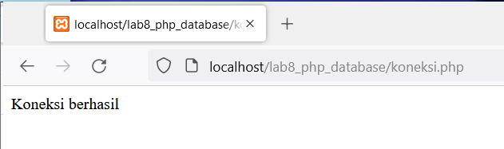
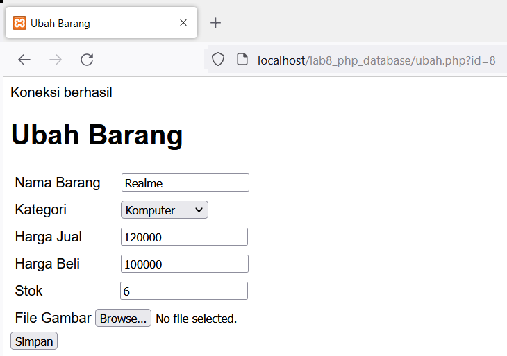

# Lab7Web

Nama  : Bangkit Akbar Anggara 
NIM   : 312010148 
Kelas : TI.20.B.1 

### Tugas
Berikut adalah tugas praktikum 7 yang dimana kita menggunakan Twitter Bootstrap untuk meyerupai seperti tampilan berikut 
 

### Pengerjaan
1. Pertama - tama kita install terlebih dahulu xamppnya kalian bisa mendownloadnya melalui link berikut ini : [Click Here](https://www.apachefriends.org/download.html) 
2. Setelah kita install buka folder xampp lalu scroll kebawah dan buka xampp_control maka akan muncul seperti berikut ini, jangan lupa aktifkan Apachenya juga 
 
3. Setelah itu kalian buka lagi folder xampp, lalu cari folder bernama htdocs dan buat folder baru bernama lab7_php_dasar seperti berikut 
 
4. Kemudian coba kalian akses direktori tersebut di browser dengan URL berikut http://localhost/lab7_php_dasar/ 
 
5. Setelah itu kalian buka Visual Studio Code kalian buat PHP Dasar seperti berikut 
 
Berikut adalah tampilannya dari program diatas 
 
6. Setelah itu kita buat Variable PHP, berikut codingannya 
 
7. Setelah itu maka tampilannya akan menjadi berikut 
 
8. Selanjutnya kita akan membuat Predefine Variable $_<n>GET, berikut adalah codingannya 
 
Berikut adalah hasilnya 
 
9. Selanjutnya kita akan membuat form input, berikut adalah codingannya 
 
Berikut adalah tampilannya 
 
10. Selanjutnya kita buta Operatornya seperti berikut 
 
Berikut adalah tampilannya 
 
11. Kita buat lagi Kondisi IF seperti berikut 
 
Berikut adalah tampilannya 
 
12. Selanjutnya juga kita buat kondisi Switchnya 
 
Berikut adalah tampilannya 
 
13. Lalu kita buat Perulangan For seperti berikut 
 
Berikut adalah tampilannya 
 
14. Lalu kita Perulangan While seperti berikut 
 
Berikut adalah tampilannya 
 
15. Selanjutnya Perulangan Dowhile berikut codingannya 
 
Berikut adalah tampilannya 
 

### JAWABAN TUGAS
Berikut adalah jawaban dari soal Pertanyaan dan Tugas 
Kalian bisa melihatnya dengan klik disamping [Click Here](tugas.php) 
Berikut adalah tampilan hasil dari codingan tersebut 
 
  
Sekian dari saya 
Terimakasih banyak sudah membaca 

#### By: Bangkit Akbar Anggara - 312010148 - TI.20.B.1
